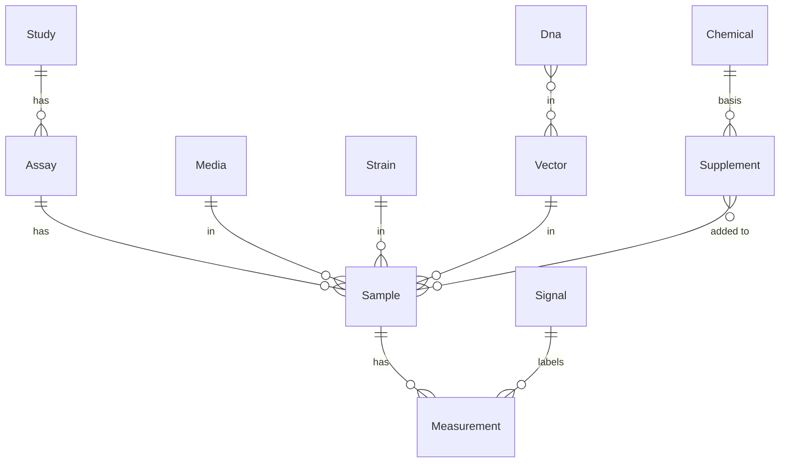

# flapjack-data

The [Flapjack](https://github.com/flapjacksynbio/flapjack_api) measurement data model as a
small, dependency-free Python package. It's the shared schema for synthetic biology
characterization data, so tools can exchange the same objects instead of incompatible CSVs.

While Flapjack is very useful, it comes with a lot of infrastructure dependencies which may
be duplicative if you already have data infrastructure that you'd like to integrate with. To
solve this, `flapjack-data` is a small package that defines just the data model and a storage
contract, so you can implement your own storage backend and still use the same data model as
Flapjack.

Right now, `flapjack-data` contains an `InMemoryStorage` implementation, which is useful for
tests and notebooks. In the future, we will add an optional `PostgresStorage` implementation
that uses Postgres/TimescaleDB as a backend.

## Data Model

The entity graph mirrors Flapjack:



Every entity is a plain dataclass; relationships are by id; ids are assigned by the storage
layer when an entity is added.

| Entity | Key fields |
| --- | --- |
| `Study` | `name`, `description`, `public` |
| `Assay` | `study_id`, `name`, `machine`, `temperature` |
| `Sample` | `assay_id`, `row`, `col`, `media_id`, `strain_id`, `vector_id`, `supplement_ids` |
| `Signal` | `name`, `description`, `color` |
| `Measurement` | `sample_id`, `signal_id`, `value`, `time` |
| `Media`, `Strain` | `name`, `description` |
| `Chemical` | `name`, `description`, `pubchemid` |
| `Supplement` | `name`, `chemical_id`, `concentration` |
| `Dna` | `name` |
| `Vector` | `name`, `dna_ids` |

## Storage Contract

`Storage` is the interface for persisting and querying the model. Implement it against any
backend (an in-memory dict, Postgres/TimescaleDB, or a remote Flapjack API) so the same
model plugs into different storage primitives.

```python
from typing import Protocol

class Storage(Protocol):
    def add(self, entity): ...
    def get(self, entity_type, entity_id): ...
    def list_all(self, entity_type): ...
    def query_measurements(self, *, study_id=None, assay_id=None,
                           sample_id=None, signal_id=None): ...
```

A zero-dependency `InMemoryStorage` is available as a reference implementation, useful for
tests and notebooks:

```python
from flapjack_data import InMemoryStorage, Study, Assay, Sample, Signal, Measurement

store = InMemoryStorage()
study = store.add(Study(name="degradation tags"))
assay = store.add(Assay(study_id=study.id, name="kinetic", machine="Clariostar"))
gfp = store.add(Signal(name="GFP"))
sample = store.add(Sample(assay_id=assay.id, row=0, col=0))
store.add(Measurement(sample_id=sample.id, signal_id=gfp.id, value=123.0, time=1.0))

store.query_measurements(study_id=study.id, signal_id=gfp.id)
```

